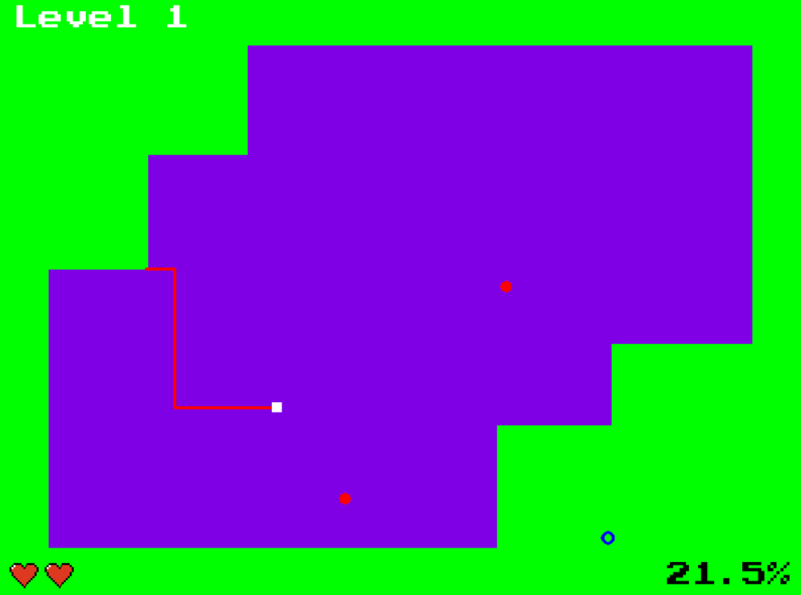

# PyGame Xonix
A game in the style of old Xonix, created in Python with PyGame.

## Gameplay
> The player controls a marker that can move around the edges of the rectangle. Holding down one of the draw buttons allows the marker to move into unclaimed territory and draw lines ("Stix") in an attempt to create a closed shape. If completed, the captured area (defined as the side opposite of where the Qix is) becomes filled in with a solid color and points are awarded. 
(*Wikipedia*)

### Additions
- On level up, one life is added (max 3).
- Every level, the difficulty is either hardened by a greater area to conquer, more balls or faster balls.


## Screenshot


## Prerequisites

- [*Python*](https://www.python.org/downloads/) 2.7 installed
- [*pygame*](https://www.pygame.org/) library installed

With pip, you can install *pygame* as following:
```
>   pip install pygame
```

## Usage
To start the game, run `Game.py`.
```
>   python Game.py
```


You're more than welcome to improve the game and add features! :-)
